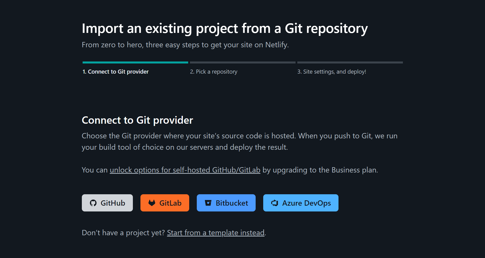
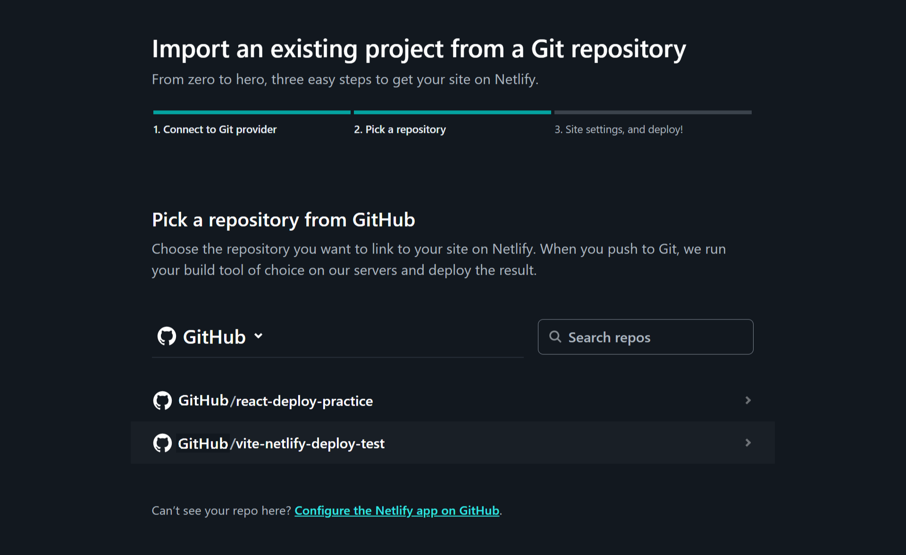
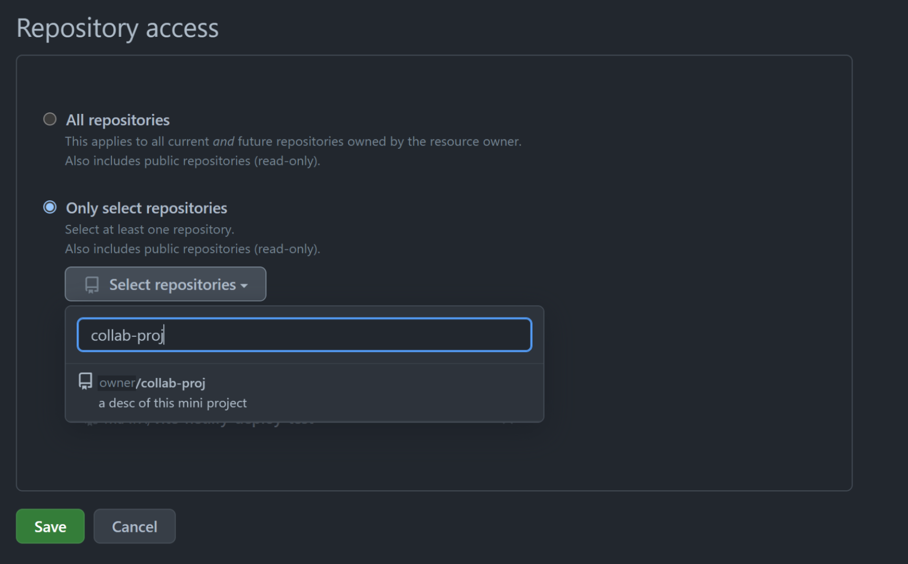
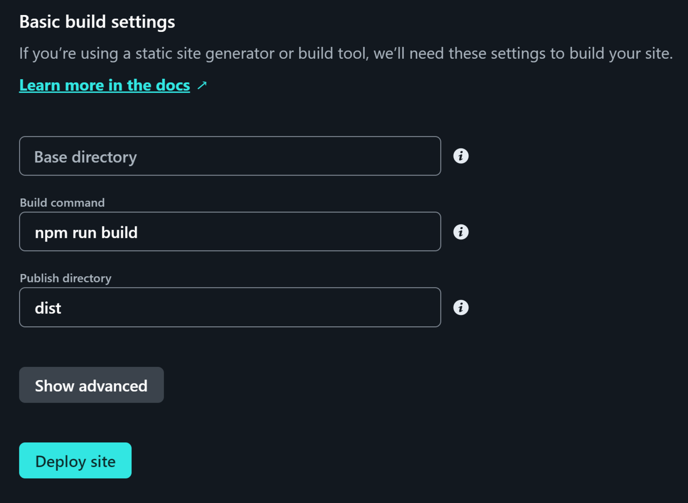
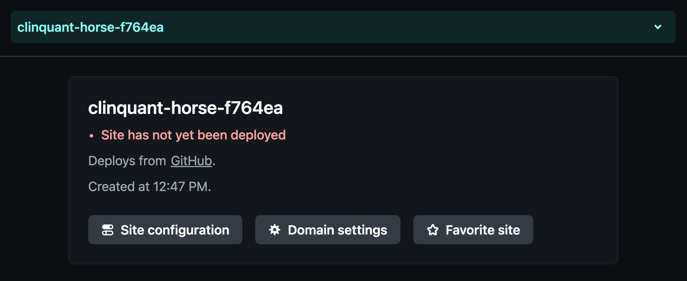
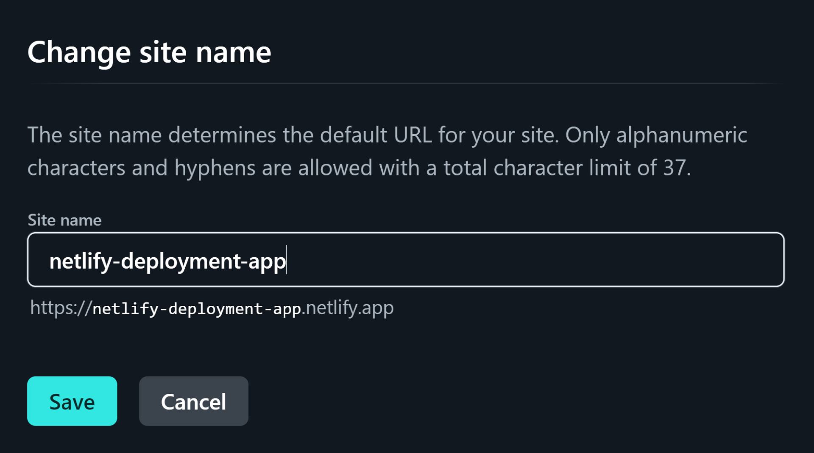

# Deploy React App to Netlify

At this point in the course, you have spent some time immersed in React and have even created some React apps of your own. React can seem confusing at first, but the good news is that `vite` gives you the tools to build applications from scratch. This guide will show you how to deploy your React app to Netlify while preserving the file structure of your source files.

## Sign up with Netlify

To set up a Netlify project, we need to log into Netlify using a GitHub account. So let's do that now by visiting the Netlify website and [logging in](https://www.netlify.com/).

## Prepare the Repo

You'll need to already have your GitHub repository setup with your application's codebase.

* Netlify will build your website from the `main` branch on GitHub.

  * Note: after deploying with this process, Netlify's Continuous Deployment model will update your live site with subsequent pushes to the `main` branch.

* When using React Router in your application, you will need overwrite Netlify's default behavior in reading your routes. We can do that by adding a simple file to your `public` folder, which will tell Netlify to route all requests back to your `index.html` file.  

  * To do so, add a `_redirects` file to the `public` folder, and add this snippet to it:

      ```txt
        /*  /index.html  200
      ```

  * Check out [Netlify's documentation history `pushState` and single-page apps](https://docs.netlify.com/routing/redirects/rewrites-proxies/#history-pushstate-and-single-page-apps) for more information.

## Deploy the Site

1. [Import the project](https://app.netlify.com/start) to Netlify.



2. Select your repository.



* You may need to add access to your repository if it is not automatically discovered by clicking the `Configure the Netlify app on Github` link at the bottom of the import page.



3. In the site settings page, you may choose the deployment branch, declare the output directory, and define environment variables.

    * For the branch, select `main`.

    * For the output/Publish directory, select `dist`.

    * To modify environment variables, click `Show advanced` (not necessary for this unit).

    * The remaining properties can be left empty and/or with their default values.



4. Click on Deploy.


5. Your Vite app is deployed!

    * Once your site is deployed, you can change your site name at any time by clicking on `Site configuration`; when changing your site name, Netlify will preview your site's new URL.





6. Click on the URL to check that everything looks good.

### Reflection

You have successfully deployed your React application to Netlify with just a few simple steps.

After your project has been imported and deployed, all changes made to the Production Branch (commonly `main`) will result in a Production Deployment.

These instructions can also be found on the [Netlify with Git](https://vitejs.dev/guide/static-deploy.html#netlify-with-git) deployment documentation.

---
© 2024 edX Boot Camps LLC. Confidential and Proprietary. All Rights Reserved.
